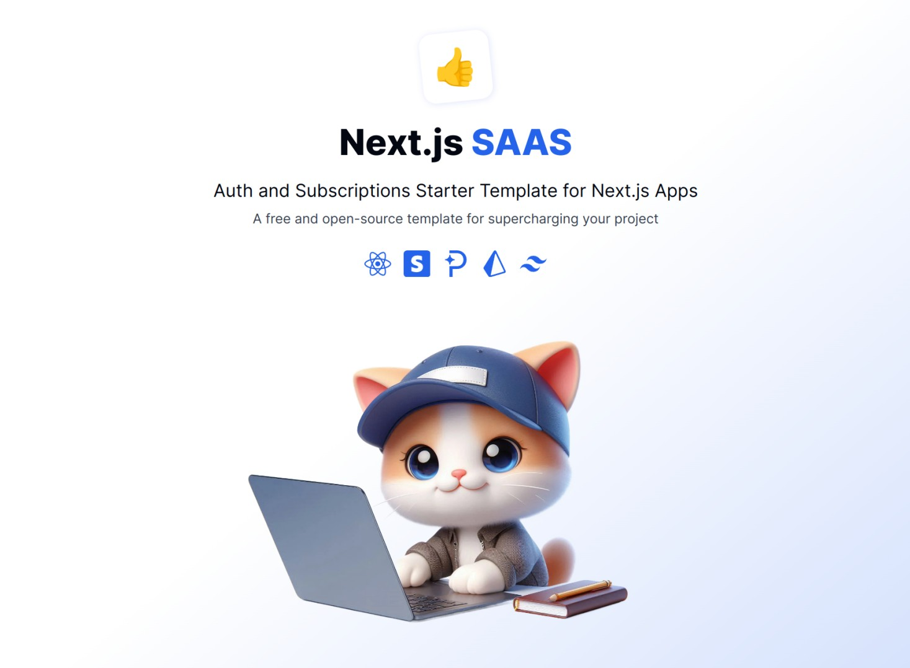

# SubFlow - Next.js SaaS Template

Kickstart your next project and focus on building instead of configuring tools.

## Demo

- [https://subflow.vercel.app/](https://subflow.vercel.app/)

[](https://subflow.vercel.app/)

## Features:

- ⚡ **Next.js 14 with App Router**: Leverage the latest features of Next.js 14 for optimal performance and scalability.
- 🔓 **User Accounts with Reflow Auth**: Seamlessly manage user authentication social sign in or email+password accounts.
- 💳 **Paid Subscriptions**: No-code checkout and recurring payments with support for both Stripe and Paddle.
- 🔺 **Prisma Integration**: Includes an example database setup for quickly connecting to your DB of choice.
- 👩‍💻 **Modern tech stack** - Uses popular developer-friendly solutions such as TypeScript, Tailwind and ESlint.
- 📱 **Fully Responsive Design**: Optimized for all devices, from mobile phones to ultra-wide screens.
- 🌙 **Dark and Light Themes**: Customizable styles based on Tailwind CSS.
- 🚀 **15+ UI Components**: Comes with components for handling dialogs, buttons, forms and more.
- 📈 **SEO-Ready**: Built with SEO best practices to ensure your site ranks well in search engines.

## Installation

Clone or fork this GitHub repo to get started.

Ahe app is a standard Next.js project. Simply install all dependencies and run the Next.js dev server.

```bash
npm install
npm run dev
```

For easier setup all important options can be configured via environment variables:

- For local dev environments make a copy of the `.env` file and rename it to `.env.local`.
- For production deployment (e.g. [Vercel](https://vercel.com/) or [Netlify](https://www.netlify.com/)) enter the environment variables during deployment configuration.

Here is a list of the available env variables:

| Prop                              | Required | Description                                                                                                                                  |
| --------------------------------- | -------- | -------------------------------------------------------------------------------------------------------------------------------------------- |
| `APP_NAME`                        | _Yes_    | The name of your app or product. Displayed in various places and used for metadata generation.                                               |
| `APP_URL`                         | _YES_    | The url address of your app. Use `http://localhost:3000` during local development.                                                           |
| `REFLOW_PROJECT_ID`               | _Yes_    | The ID of your Reflow project. You can obtain your project ID from the dashboard [settings page](https://reflowhq.com/project/settings).     |
| `REFLOW_SECRET`                   | _Yes_    | A secret string that will be used for encrypting user sessions. Run `openssl rand -hex 16` in the terminal to generate a random 32-char key. |
| `REFLOW_TEST_MODE`                | _No_     | Set this to `true` if you want to run the app in [test mode](https://reflowhq.com/docs/help/test-mode/).                                     |
| `PAYMENT_PROVIDER`                | _No_     | The payment provider to be used for subscription payments, either `stripe` or `paddle`.                                                      |
| `DATABASE_PRISMA_URL`             | _No_     | The connection url to your main database. The format will differ based on your database of choice.                                           |
| `DATABASE_PRISMA_URL_NON_POOLING` | _No_     | A non-pooling connection url used during Prisma migrations.                                                                                  |

## Connecting a Database

The project includes a simple proof-of-concept task management app. It is built using a [Vercel Postgres](https://vercel.com/storage/postgres) database, but you can connect to any other serverless DB provider or a local database by modifying the [schema.prisma](./prisma/schema.prisma) configuration file.

Whenever you make changes to your schema run `npm run migrate-dev` to update your database and generate prisma client types.
